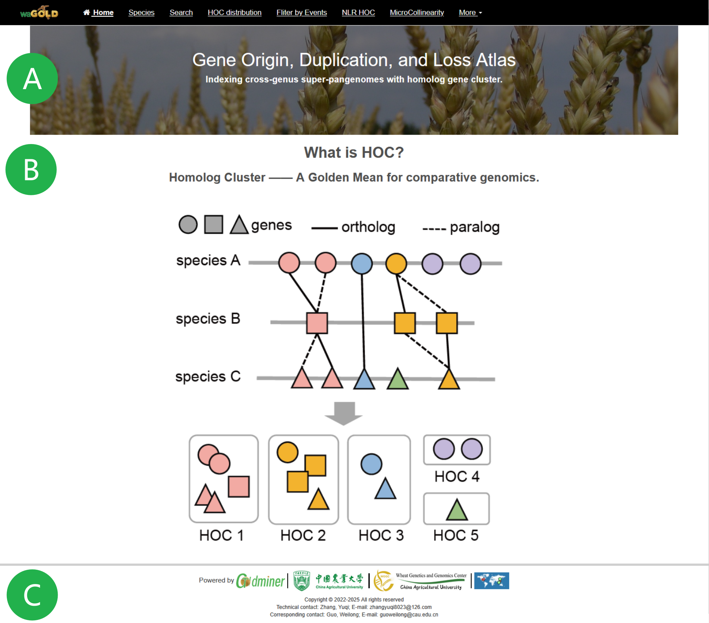
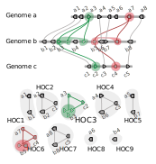
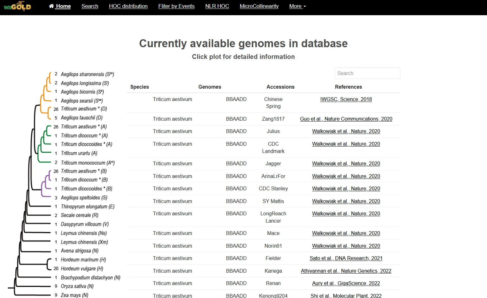
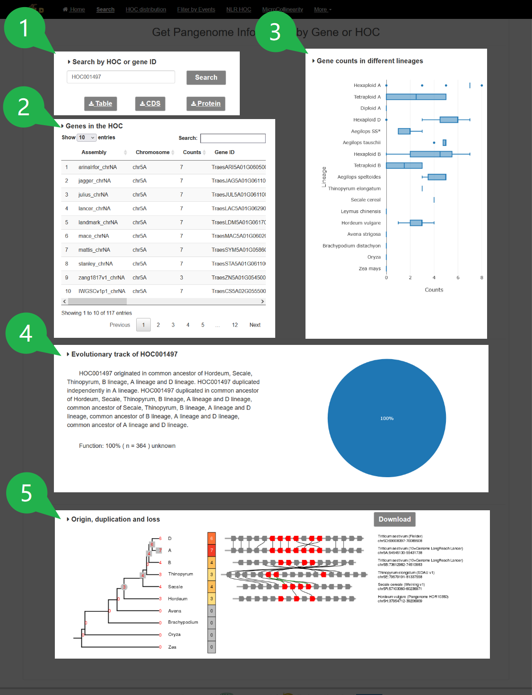
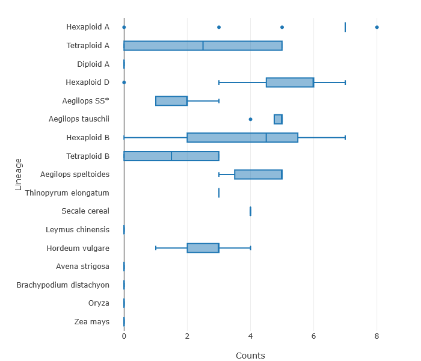
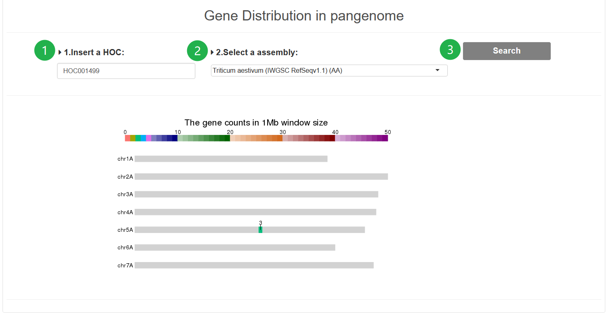
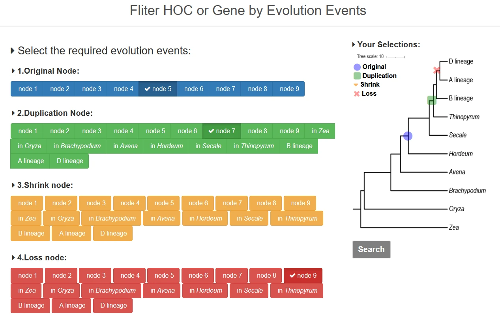
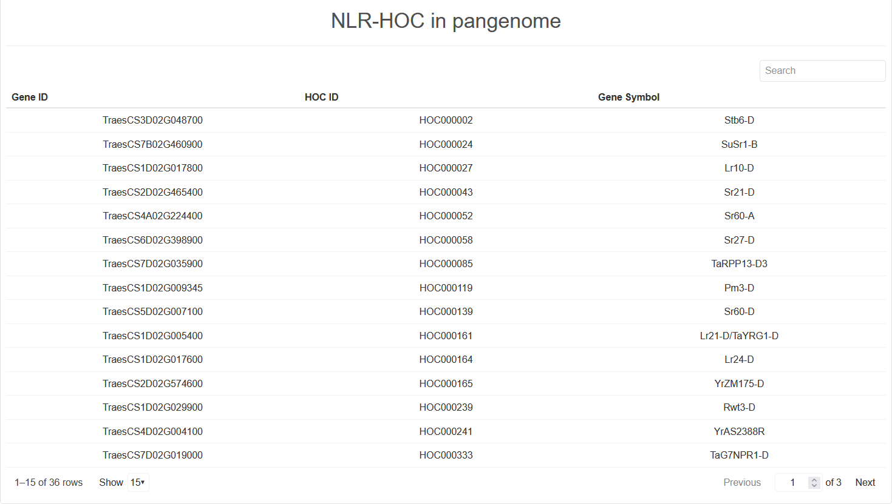

# General

## Homepage of waGOLD

**waGOLD**: **w**ebserver for the **a**tlas of **G**ene **O**rigin, **L**oss, and **D**uplication events in Poaceae.

**A**. The logo and functional modules of the database.

**B**. The definition of Homologous Gene Clusters (HOCs).

**C**. The footer displays sponsoring institutions and website visit statistics.

## Examples of Homologous Gene Clusters (HOCs)

The HOC identification process consists of three sequential steps:
1.  **Cluster Identification within Individual Genomes (N=1):** Gene clusters are identified within each genome based on genomic proximity and sequence similarity. Genes are represented as colored shapes, with identical colors indicating genes belonging to the same cluster.
2.  **Pairwise Genome Comparison (N=2):** Homologous Gene Clusters (HOCs) are identified between pairs of genomes by establishing connections between collinear genes. Collinearity is indicated by matching colors and connecting lines that preserve gene order and orientation.
3.  **Multi-genome HOC Construction (N ≥ 3):** HOCs are constructed across multiple genomes by integrating pairwise comparisons. The resulting HOCs (HOC1-HOC9) represent evolutionarily conserved gene clusters present across the analyzed genomes, with each HOC containing genes that share sequence homology and maintain a syntenic genomic organization. Grey shading delineates the boundaries of each identified HOC.

## Note
Additionally, waGOLD offers various functionalities for visualization, data export (in PDF, PNG, and CSV formats), and provides links to external databases. All tools use numbered steps (e.g., 1, 2, 3) to guide users through the input process. The layout of each module is divided into two main sections: an input area and an output area.

Users can click the `Example` button to load default data and get started quickly.

# Species

The phylogenetic tree on the left, derived from Goldminer, illustrates the relationships between the assemblies included in the database. The table on the right provides details for each species, including annotation versions, genome assembly information, and publication references. Clicking on a branch in the phylogenetic tree will filter the table on the right to display the available assemblies for the corresponding species.

# Search

## 1. Search by HOC or Gene ID

Enter a gene ID or HOC ID into the input box and click the `Search` button. The tool will retrieve basic information for the specified HOC or the HOC containing the specified gene. After the search is complete, you can download the HOC data, which includes gene `Tables`, `CDS` sequences, and `Protein` sequences, by clicking the respective download buttons.

## 2. Genes in the HOC

| Assembly | Chromosome | Counts | Gene ID |
| :--- | :--- | :--- | :--- |
| arinalrfor_chrNA | chr5A | 7 | TraesARI5A01G060500,TraesARI5A01G060600,TraesARI5A01G060400,TraesARI5A01G060800,TraesARI5A01G060700,TraesARI5A01G061000,TraesARI5A01G060900 |
| jagger_chrNA | chr5A | 7 | TraesJAG5A01G061100,TraesJAG5A01G061600,TraesJAG5A01G061700,TraesJAG5A01G061200,TraesJAG5A01G061300,TraesJAG5A01G061400,TraesJAG5A01G061800 |
| ... | ... | ... | ... |

This section displays a table containing the **Assembly**, **Chromosome**, the **Count** of genes, and the **Gene IDs** for each species within the HOC. To download this data, click the `Tables` button located above the table.

## 3. Gene Counts in Different Lineages

This box plot visualizes the distribution of gene counts within the HOC across different species lineages, based on the data from the table above.

## 4. Evolutionary and Functional Analysis of the HOC

This section is divided into two parts. On the left, a summary describes the inferred origin, duplication, and loss events for the HOC. It also provides a putative function for the HOC, derived from the functional annotations of its member genes. On the right, an interactive pie chart displays the classification and proportions of gene functions within the HOC.

## 5. Origin, Duplication, and Loss Plot

This visualization consists of three main components.
*   **Species Tree (Left):** The leftmost panel displays a species tree. The numbers on the terminal branches indicate the actual count of genes in the HOC for each species. The numbers at the ancestral nodes, inferred using a dynamic programming algorithm, represent the estimated gene counts in ancestral lineages. Symbols on the tree—circles (`●`), squares (`■`), and crosses (`X`)—represent origin, duplication, and loss events, respectively.
*   **Heatmap (Center):** The central panel is a heatmap that visualizes the gene count for each species. A deeper red color indicates a higher number of genes, while gray indicates a count of zero.
*   **Micro-collinearity Plot (Right):** The rightmost panel shows a micro-collinearity plot for the genomic region of the HOC in each corresponding species. You can click on any gene (represented by a pentagon). Genes belonging to the current HOC are colored red, while those from other HOCs are gray. Clicking a gene reveals its ID, HOC ID, genomic location, and functional description.

# HOC Distribution

**Step 1.** Enter an HOC ID.

**Step 2.** Select a reference assembly from the dropdown menu to visualize the HOC distribution.

**Step 3.** Click the `Search` button to run the analysis. The results will be displayed in the output area below.

**Output:** A visualization of the genomic distribution of the specified HOC on the chromosomes of the selected assembly.

# Filter by Events

Select the desired evolutionary events (e.g., origin, duplication, loss) in the left panel. The species tree will update in real-time to highlight the lineages where these events occurred. After setting your criteria, click the `Search` button to retrieve a downloadable list of HOCs that match your filters.

# NLR HOC

This page provides statistics for Homologous Gene Clusters containing Nucleotide-binding Leucine-rich repeat (NLR) genes (NLR-HOCs), particularly those corresponding to known cloned disease-resistance genes. Gene IDs are based on the IWGSC RefSeq v2.1 annotation.

# MicroCollinearity

waGOLD can visualize micro-collinearity for a specific HOC across multiple species.

**Step 1.** Enter a query gene ID.

**Step 2.** Select the reference assembly for the query gene from the dropdown menu.

**Step 3.** Select one or more target assemblies for comparison from the pop-up window.

**Step 4.** (Optional) Input a number of neighboring genes.

**Step 5.** Customize the visualization with the following options:
1.  **One-to-many:** When selected, all homologous gene pairs are displayed. If unselected, only one-to-one orthologs (e.g., Reciprocal Best Hits) are shown.
2.  **Real spacing:** When selected, genes are positioned according to their actual genomic coordinates. If unselected, genes are spaced evenly according to their rank order.

**Step 6.** Click the `GO` button to generate the visualization, which will appear in the output area below.

**Output:** The plot displays genes and the connecting lines that represent homologous pairs. These pairs are colored based on their relationship type (e.g., RBH, SBH, singleton, one-to-many). The query gene is highlighted with a red triangle. Only genomes containing a collinear block with the query region will be displayed. The evolutionary history of the genes can be traced from the bottom (outgroup) to the top (more recent species) of the plot.

**Note:** All genes in the plot are clickable. Clicking a gene will display its ID and provide links to external expression databases.

