# General (概述)

## waGOLD 主页

<!--  -->
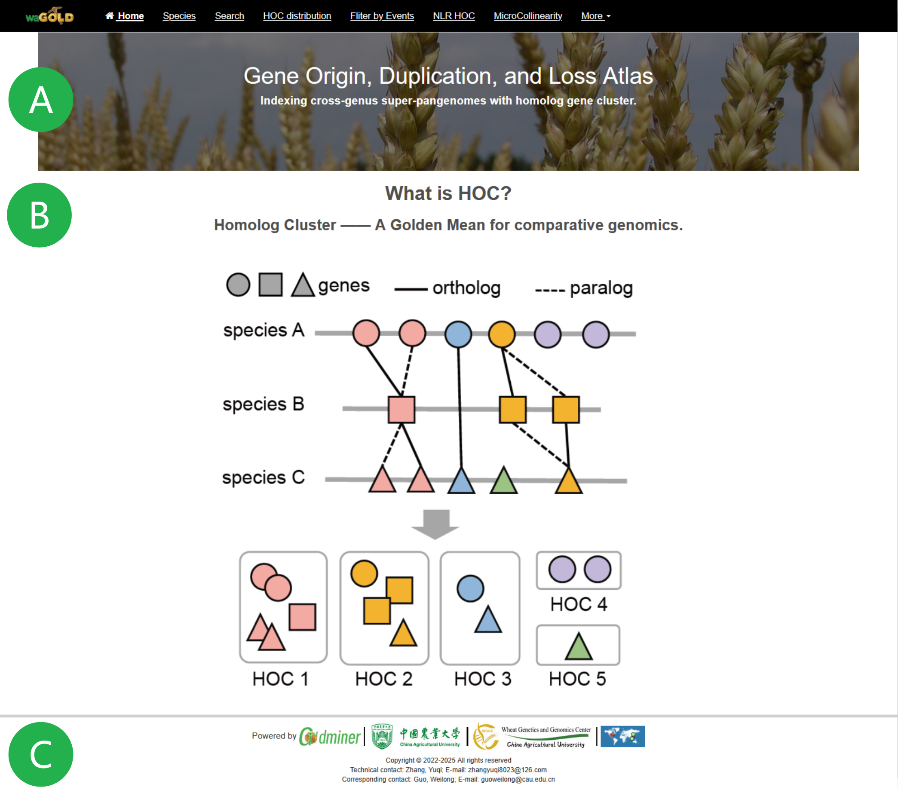

**waGOLD**: **w**ebserver for the **a**tlas of **G**ene **O**rigin, **L**oss, and **D**uplication events in Poaceae (禾本科基因起源、丢失和复制事件图谱的在线数据库服务)。

**A**. 数据库的 Logo 和功能模块。

**B**. 同源基因簇 (Homologous Gene Clusters, HOCs) 的定义。

**C**. 页脚显示了资助机构和网站访问统计。

## 同源基因簇 (HOCs) 示例
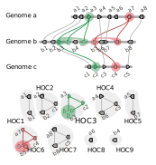

HOC 的鉴定过程包括三个连续的步骤：
1.  **单个基因组内的簇鉴定 (N=1):** 在每个基因组内，基于基因组邻近性和序列相似性来鉴定基因簇。基因由不同颜色的形状表示，相同的颜色表示属于同一个簇的基因。
2.  **成对基因组比较 (N=2):** 通过在共线性基因之间建立连接来鉴定成对基因组间的同源基因簇 (HOCs)。共线性由匹配的颜色和保持基因顺序及方向的连接线表示。
3.  **多基因组 HOC 构建 (N ≥ 3):** 通过整合多个成对比较来构建跨多个基因组的 HOC。最终得到的 HOCs (HOC1-HOC9) 代表了在所分析的基因组中进化上保守的基因簇，每个 HOC 包含的基因都共享序列同源性并保持共线性的基因组组织结构。灰色阴影描绘了每个已鉴定 HOC 的边界。

## 注意
此外，waGOLD 还提供多种功能，包括可视化、数据导出（支持 PDF、PNG 和 CSV 格式），以及到外部数据库的链接。所有工具都使用编号步骤（如 1, 2, 3）来引导用户完成输入过程。每个模块的布局都分为两个主要部分：输入区和输出区。

用户可以点击 `Example` (示例) 按钮加载默认数据以快速开始使用。

# Species (物种)

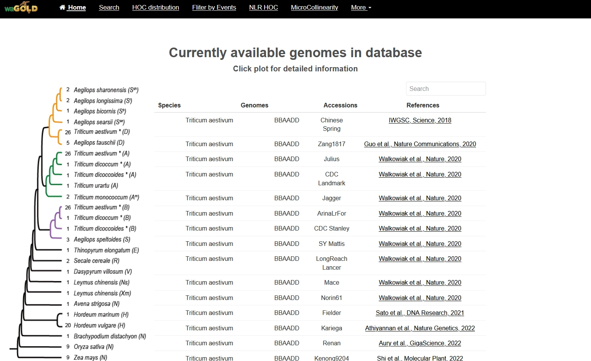

左侧的系统发育树（来源于 Goldminer）展示了数据库中包含的基因组组装体之间的关系。右侧的表格提供了每个物种的详细信息，包括注释版本、基因组组装信息和参考文献。点击左侧系统发育树上的一个分支，右侧的表格将会根据您的点击，筛选并显示相应物种的可用基因组组装。

# Search (搜索)

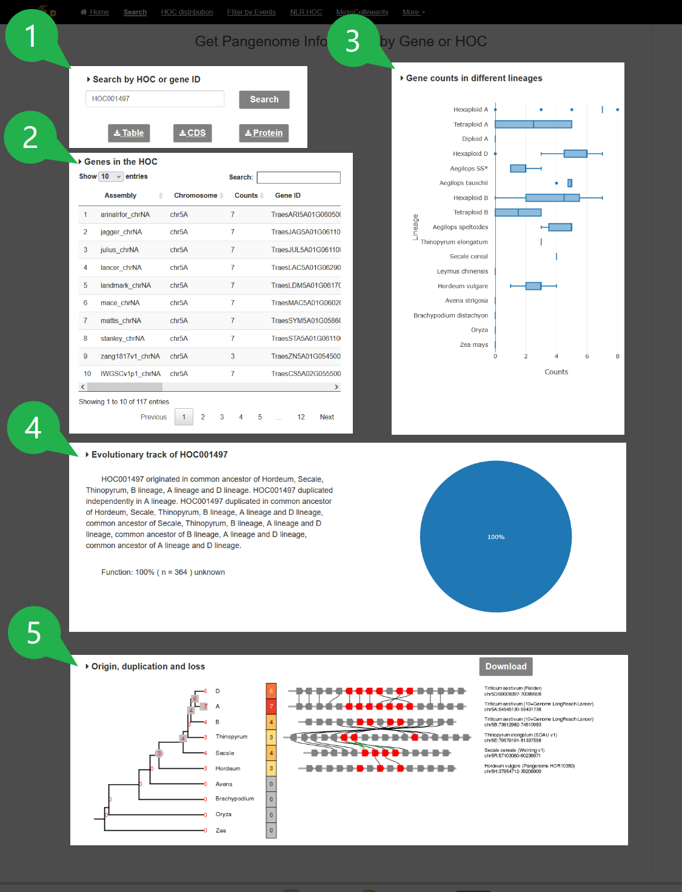

## 1. 按 HOC 或基因 ID 搜索

在输入框中输入一个基因 ID 或 HOC ID，然后点击 `Search` (搜索) 按钮。该工具将检索指定 HOC 的基本信息，或指定基因所在的 HOC 的信息。搜索完成后，您可以通过点击相应的下载按钮，下载该 HOC 的数据，包括基因的 `Tables` (表格)、`CDS` (编码序列) 和 `Protein` (蛋白质序列)。

## 2. HOC 中的基因

| Assembly | Chromosome | Counts | Gene ID |
| :--- | :--- | :--- | :--- |
| arinalrfor_chrNA | chr5A | 7 | TraesARI5A01G060500,TraesARI5A01G060600,TraesARI5A01G060400,TraesARI5A01G060800,TraesARI5A01G060700,TraesARI5A01G061000,TraesARI5A01G060900 |
| jagger_chrNA | chr5A | 7 | TraesJAG5A01G061100,TraesJAG5A01G061600,TraesJAG5A01G061700,TraesJAG5A01G061200,TraesJAG5A01G061300,TraesJAG5A01G061400,TraesJAG5A01G061800 |
| ... | ... | ... | ... |

本节显示一个表格，其中包含 HOC 内每个物种的**组装 (Assembly)**、**染色体 (Chromosome)**、基因**数量 (Count)** 和**基因 ID (Gene IDs)**。要下载此数据，请点击表格上方的 `Tables` (表格) 按钮。

## 3. 不同谱系中的基因数量

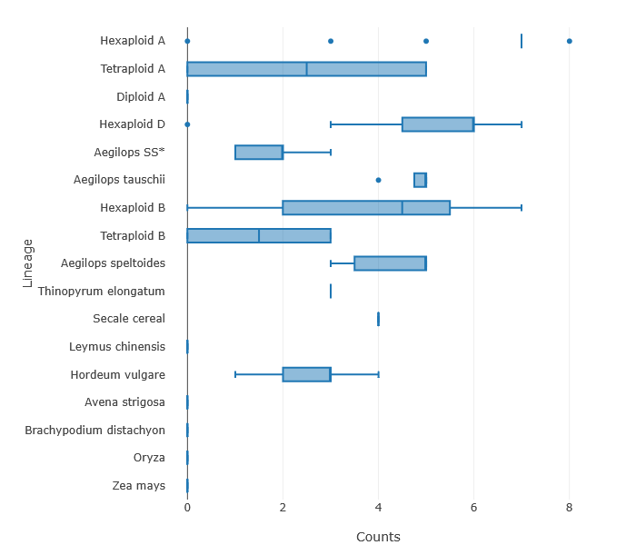

该箱线图基于上表的数据，可视化了 HOC 内基因数量在不同物种谱系中的分布情况。

## 4. HOC 的进化与功能分析

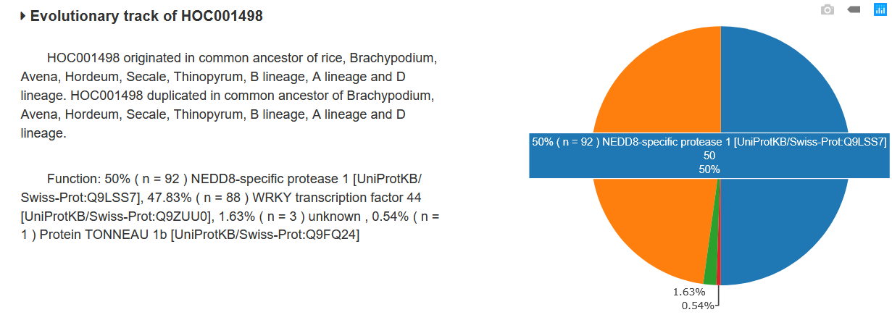

本节分为两部分。左侧是一段摘要，描述了该 HOC 推断的起源、复制和丢失事件，并根据其成员基因的功能注释，提供了该 HOC 的推定功能。右侧是一个交互式饼图，显示了 HOC 内基因功能的分类和比例。

## 5. 起源、复制和丢失图

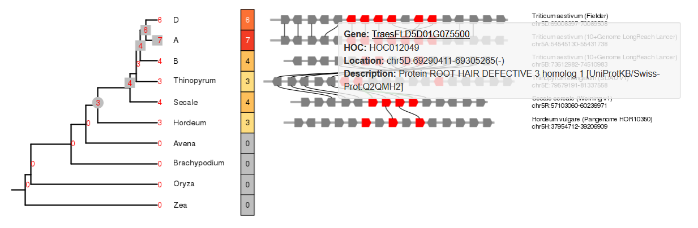

该可视化图由三个主要部分组成。
*   **物种树 (左侧):** 最左侧面板显示了一个物种树。末端分支上的数字表示每个物种中该 HOC 的实际基因数量。祖先节点上的数字是使用动态规划算法推断的，代表了祖先谱系中估计的基因数量。树上的符号——圆圈 (`●`)、方块 (`■`) 和叉 (`X`)——分别代表起源、复制和丢失事件。
*   **热图 (中间):** 中间面板是一个热图，用于可视化每个物种的基因数量。颜色越红表示基因数量越多，灰色表示数量为零。
*   **微共线性图 (右侧):** 最右侧面板显示了每个对应物种中该 HOC 基因组区域的微共线性图。您可以点击任何一个基因（由五边形表示）。属于当前 HOC 的基因被涂成红色，而来自其他 HOC 的基因则为灰色。点击一个基因会显示其 ID、HOC ID、基因组位置和功能描述。

# HOC Distribution (HOC 分布)

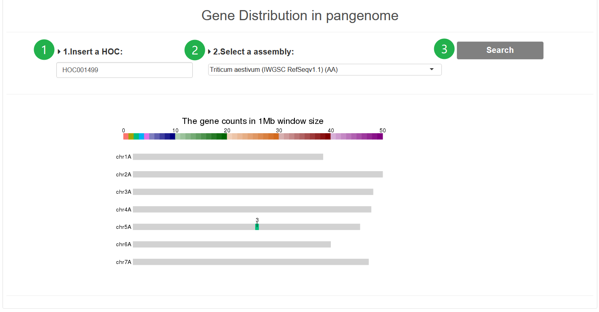

**步骤 1.** 输入一个 HOC ID。

**步骤 2.** 从下拉菜单中选择一个参考基因组组装，以可视化 HOC 的分布。

**步骤 3.** 点击 `Search` (搜索) 按钮运行分析。结果将显示在下方的输出区域。

**输出:** 在所选基因组组装的染色体上，指定 HOC 的基因组分布可视化图。

# Filter by Events (按事件筛选)

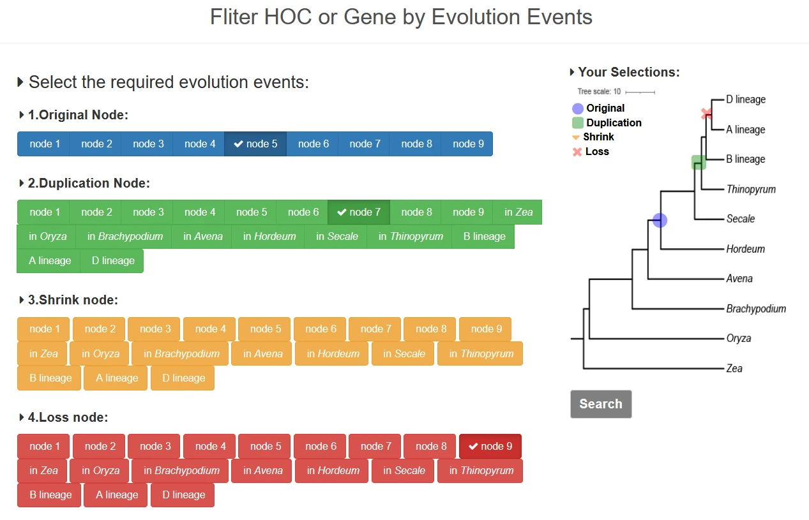

在左侧面板中选择所需的进化事件（例如，起源、复制、丢失）。物种树将实时更新，以高亮显示发生这些事件的谱系。设置好标准后，点击 `Search` (搜索) 按钮，即可检索到一份与您的筛选条件匹配的 HOC 列表（可供下载）。

# NLR HOC (NLR 基因簇)

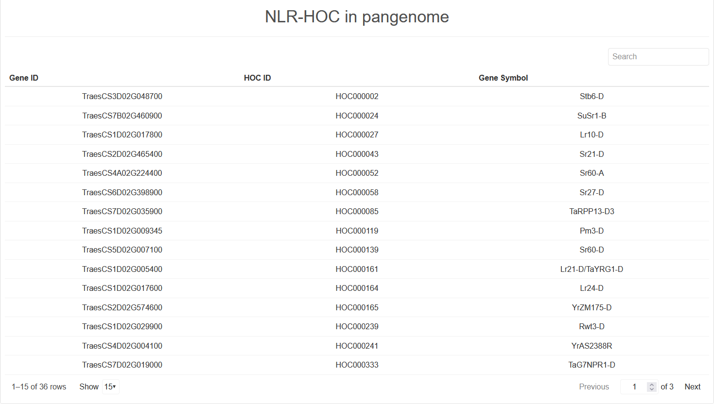

本页面提供了包含 NLR (核苷酸结合-富含亮氨酸重复序列) 基因的同源基因簇 (NLR-HOCs) 的统计信息，特别是那些与已知的克隆抗病基因相对应的基因簇。基因 ID 基于 IWGSC RefSeq v2.1 注释。

# MicroCollinearity (微共线性)

waGOLD 可以可视化特定 HOC 在多个物种间的微共线性。

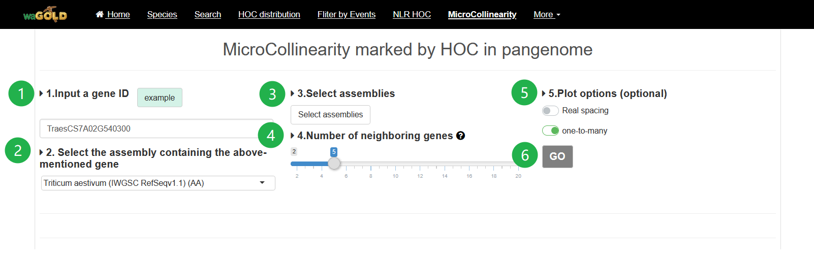

**步骤 1.** 输入一个查询基因 ID。

**步骤 2.** 从下拉菜单中选择查询基因所在的参考基因组组装。

**步骤 3.** 从弹出窗口中选择一个或多个目标基因组组装进行比较。

**步骤 4.** (可选) 输入一个特定的染色体区域（格式：`chromosome:start-end`）进行高亮显示。

**步骤 5.** 使用以下选项自定义可视化效果：
1.  **One-to-many (一对多):** 选中后，将显示所有同源基因对。如果未选中，则只显示一对一的直系同源基因（例如，相互最佳匹配基因）。
2.  **Real spacing (真实间距):** 选中后，基因将根据其在基因组上的实际坐标进行定位。如果未选中，基因将根据其排列顺序均匀分布。

**步骤 6.** 点击 `GO` 按钮生成可视化图，该图将显示在下方的输出区域。

**输出:** 该图显示了基因以及代表同源基因对的连接线。这些基因对根据其关系类型（例如，RBH、SBH、singleton、一对多）进行着色。查询基因用红色三角形高亮显示。只有与查询区域存在共线性区块的基因组才会被显示。基因的进化历史可以从图的底部（外类群）追溯到顶部（较近的物种）。

**注意:** 图中所有基因均可点击。点击基因会显示其 ID，并提供到外部表达数据库的链接。

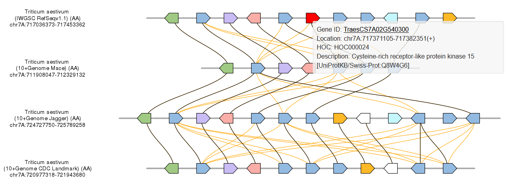